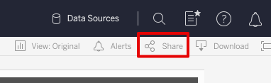
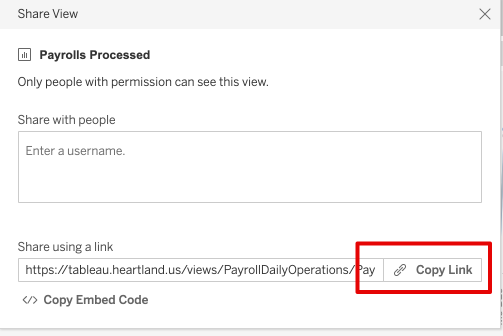
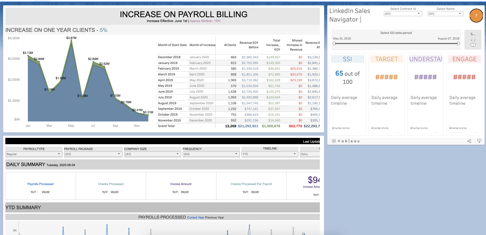

# Tableau in Salesforce #

This document describes the process of adding Tableau workbooks as a Salesforce component on various Lightning pages.

---

## Requirements ##

### Tableau ###

* Some level of access to Heartland's Tableau instance

* Visibility to the workbook being displayed within Salesforce

* Active Heartland SSO session

### Salesforce ###

* Access to the Lightning page containing the Tableau dashboards

* Active Heartland SSO session

* Visibility to the component containing the specific dashboard (via Lightning App Builder visibility settings on a component)

## Setup ##

1. If the component in this repo does not already exist in the target Salesforce instance, clone this repo

    ```bash
    git clone git@github.com:HPSSFDC/tableau-viz-lwc.git
    ```
    <!-- markdownlint-disable MD033 -->
    and deploy it through standard deploy methods.<br/> <br/>
    <!-- markdownlint-enable MD033 -->

1. In Tableau: open the Tableau Workbook and copy the "Share" URL from the **Share** menu
    
    

1. In Salesforce: open the Lightning page in Lightning App Builder, add the **Tableau Visualization** component to the page, and paste the link that was copied in the previous step into the **Enter the Viz URL** field in the component configuration section.

1. Add any of the Viz [URL Parameters](https://help.tableau.com/current/pro/desktop/en-us/embed_list.htm#URL_params) to configure the workbook filters, size, etc. to your liking. Save the Lightning Page and assign it if necessary.

## Usage ##

### Report Layout ###

The reports in Tableau will need to be formatted in a way that compliments the embedding capabilities within this tool. Tableau Desktop offers different layout options available for each report -- `desktop`, `tablet`, and `phone`. If the layout is not configured appropriately, the reports in Salesforce may have scroll bars within each component, they may not show the whole report appropriately, and the report filtering may not be placed in an intuitive/natural position on the report (example below). To fix this, configure the report layout in Tableau to accomodate for the aesthetics in Salesforce.



### Salesforce Layout ###

Each component that holds a Tableau report can have the height increased but the component width cannot be set without some extra development. Salesforce Lightning Pages use layout templates that determine the width of the components. There are several templates provided by Salesforce to choose from, or a Salesforce Developer can create a custom layout template that can be used. The screenshot above is using a Salesforce-provided template. Other Salesforce-provided templates include a 3-column layout, a 2-column layout (split exactly down the middle as opposed to the 2:1 split in the above screenshot), a header row with 2 columns, etc. Again, this can be customized with some development.

The components can be added to a Record page in Salesforce, i.e. on an Account page. This will allow us to use a value from the Account record -- like a FEIN or Client Code -- to filter the Tableau report. The filter value in Salesforce must match a value on the Tableau report, and is configured when adding the component to the record page in Salesforce.

### Filtering ###

Tableau report filtering from a Home Page will require some extra development to the component. Report filtering on a Record Page (viewing a Client record, for example) should be available currently.
